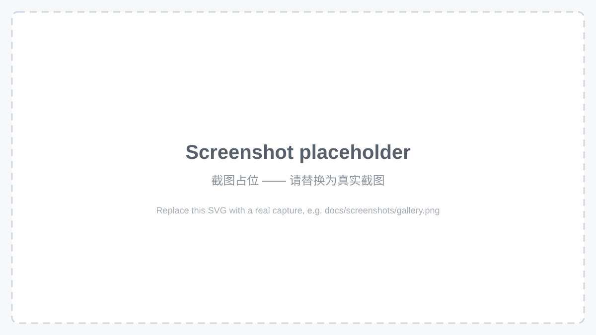
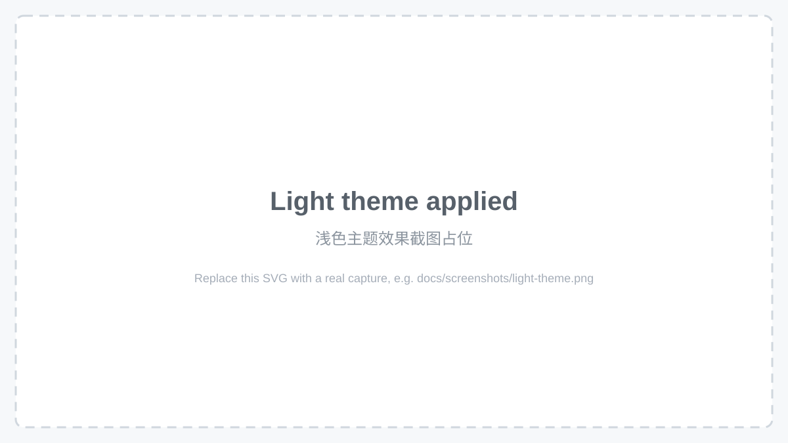
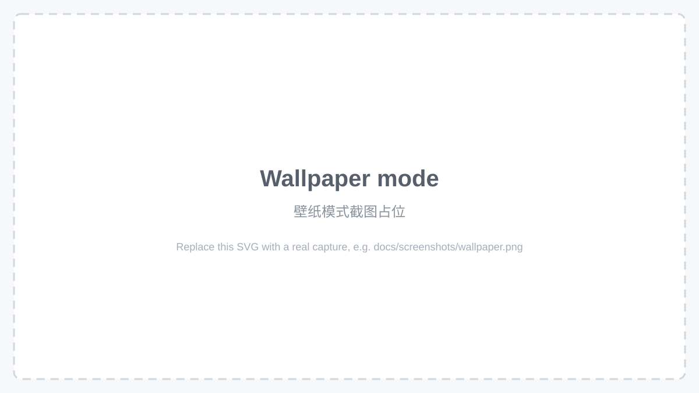
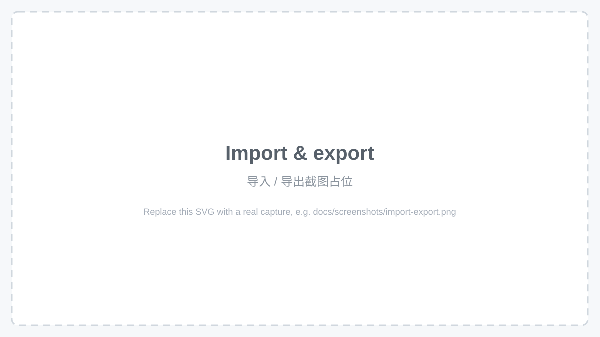

<p align="center">
  
</p>

# dsh-theme-center 主题中心

[中文](README-zh.md) | English

[](LICENSE)
[](package.json)

DeepSeek Harness 内置的主题中心 —— 精选内置主题画廊（浅色 / 深色分组）、一键切换、
自定义图片壁纸与裁切编辑、以及 dsh-theme 主题文件的导入 / 导出。
打开 **设置 → 主题** 即可使用。



点击卡片即时换肤 —— 选择在重启后依然保留：



## 安装 Install

```sh
dsh plugin --profile web add <本仓库绝对路径>
```

在 `$DSH_HOME/profiles/web/cordis.patch.yml` 中启用插件：

```yaml
- insert:
    - id: theme-center
      name: dsh-theme-center
```

重启 `dsh web`，然后打开 **设置 → 主题**。

## 功能特性 What you get

- **精选内置主题** —— 11 个主题，每个一种视觉身份；浅色 / 深色分组，
  3 列画廊网格展示
- **一键切换** —— 点击卡片即时换肤，选择持久化，刷新后保留
- **自定义壁纸** —— 任意图片作为界面背景，支持实时裁切 / 色调编辑
  （平移、缩放、遮罩不透明度、面板透明度）
- **dsh-theme 文件** —— 导入他人编写的主题（文件或粘贴），也可导出自己的主题；
  格式有完整文档
- **中英双语界面**

## 壁纸 Wallpaper



- 选择图片 —— 图片会在本地缩放到 1440px（JPEG q0.72）并存入设置
- 横幅预览显示**完整图片**，虚线框标记真实显示区域 —— 框内所见即所得
- 拖拽平移虚线框，滚轮缩放（100%–300%）；滑杆调节文字可读性遮罩与面板透明度
- 所有参数持久化在 `theme-center` 设置命名空间

## 主题文件格式 Theme file format

主题是可移植的 JSON 文档 —— 可以自己编写，也可以直接导入存档的主题：

```json
{
  "format": "dsh-theme",
  "version": 1,
  "id": "aurora",
  "name": "Aurora",
  "description": "A deep violet night sky.",
  "colorScheme": "dark",
  "tokens": {
    "--dsw-alias-bg-base": "#0d0b1e",
    "--dsw-alias-label-primary": "#ece9fb"
  },
  "wallpaper": "data:image/jpeg;base64,...."
}
```

完整参考：[docs/theme-file-format.zh.md](docs/theme-file-format.zh.md) ·
英文版：[docs/theme-file-format.md](docs/theme-file-format.md) ·
示例：[`examples/aurora.dsh-theme.json`](examples/aurora.dsh-theme.json)



## 内置主题 Built-in themes

| id | 名称 Name | 色系 Scheme | 描述 Description |
| -- | --------- | ----------- | ---------------- |
| `light` | 原版亮 Original Light | light | 纯白 · 靛蓝 · DeepSeek 原版 |
| `claude` | Claude 风格 | light | 暖米 · 陶土橙 · Claude 美学 |
| `sakura` | 樱花粉 | light | 柔粉 · 玫瑰 · 春日浪漫 |
| `paper` | 纸张护眼 | light | 暖纸 · 棕褐 · 护眼阅读 |
| `dark` | 原版暗 Original Dark | dark | 炭黑 · 靛蓝 · DeepSeek 原版 |
| `claude-dark` | Claude 暗色 | dark | 暖炭 · 陶土橙 · Claude 夜间 |
| `tokyo-night` | 东京之夜 | dark | 深蓝 · 亮蓝 · 东京夜色 |
| `graphite` | 石墨黑 | dark | 石墨 · 月白 · 高对比单色 |
| `monokai` | Monokai | dark | 墨绿 · 青绿 · 高对比经典 |
| `gruvbox` | Gruvbox | dark | 暖棕 · 琥珀 · 复古怀旧 |
| `wallpaper` | 自定义壁纸 | light/dark | 自定义图片 · 可调遮罩 · 壁纸模式 |

所有被移除的调色板（v1.1.0 精简 + v1.2.0 移除）都以可导入的 dsh-theme 文件
**存档在 [`docs/archive/`](docs/archive/)，而不是删除** —— 共 14 个主题，
一键即可恢复为自定义主题。完整色卡参考：[docs/theme-catalog.md](docs/theme-catalog.md)

## 注意事项 Notes

- **已知的宿主依赖。** 浏览器侧设置读写走 API 网关白名单
  （`dsh-host-apiproxy` 里的 `WEB_SETTINGS_NAMESPACES`）；本插件能持久化的前提
  是把 `"theme-center"` 加入该白名单。目前需要手动打补丁 —— 升级 / 重装 dsh
  后需重新打补丁（补丁位置与步骤见
  [源码仓库 README](https://github.com/dsh-market/dsh-theme-center)）。
- **开发** —— `pnpm install` → `pnpm typecheck` → `pnpm build`；
  `node scripts/smoke.mjs` 可在无浏览器环境下运行控制器冒烟测试。

## License

MIT · [dsh-market](https://github.com/dsh-market) · 文档见 [`docs/`](docs/)
