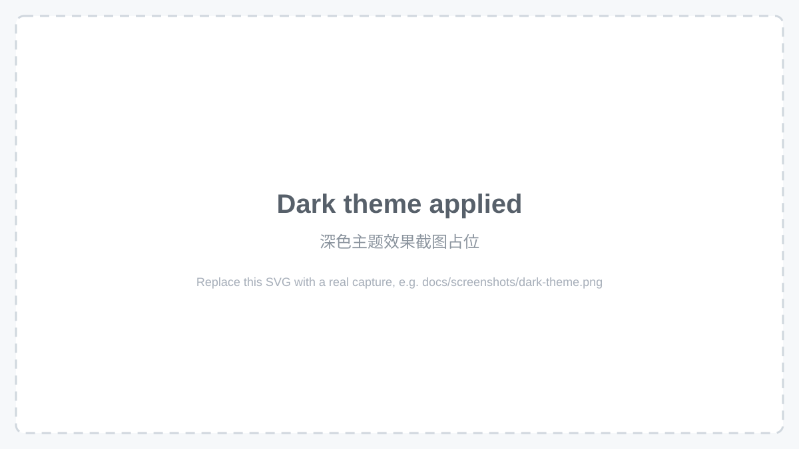

# dsh-theme-center 主题中心

[](LICENSE)
[](package.json)

dsh Web 界面的主题插件 —— 内置精选主题画廊（浅色 / 深色分组）、一键切换、
自定义图片壁纸与裁切编辑、以及 dsh-theme 主题文件的导入 / 导出。

> A theme plugin for the **dsh** web UI — a curated gallery of built-in themes,
> one-click switching, an image wallpaper mode with a crop/tint editor, and
> import/export of user-authored `dsh-theme` files.

---

## 截图 Screenshots

> 目前提交的是占位 SVG，保证 README 立即可渲染 —— 请把每个占位替换为真实截图
> （`docs/screenshots/*.png`）。详见 [docs/screenshots/README.md](docs/screenshots/README.md)。

| 主题画廊 Gallery | 浅色主题 Light theme | 深色主题 Dark theme |
| ---------------- | -------------------- | ------------------- |
|  |  |  |

| 壁纸模式 Wallpaper | 导入 / 导出 Import / Export |
| ------------------ | --------------------------- |
|  |  |

## 特性 Features

- **精选内置主题** —— 13 个主题，每个一种视觉身份（[目录参考](docs/theme-catalog.md)）；
  浅色 / 深色分组，3 列画廊网格展示。
- **一键切换** —— 点击卡片即时换肤，选择持久化，刷新后保留。
- **自定义壁纸** —— 任意图片作为界面背景，支持实时裁切 / 色调编辑
  （平移、缩放、遮罩不透明度、面板透明度）。
- **dsh-theme 文件** —— 导入他人编写的主题（文件或粘贴），也可导出自己的主题；
  格式完整文档见 [docs/theme-file-format.zh.md](docs/theme-file-format.zh.md)。
- **中英双语界面**。

## 内置主题 Built-in themes

| id | 名称 Name | 色系 Scheme | 描述 Description |
| -- | --------- | ----------- | ---------------- |
| `light` | 原版亮 Original Light | light | 纯白 · 靛蓝 · DeepSeek 原版 |
| `claude` | Claude 风格 | light | 暖米 · 陶土橙 · Claude 美学 |
| `minimal` | 极简风格 | light | 纯白 · 纯黑 · 极简主义 |
| `sakura` | 樱花粉 | light | 柔粉 · 玫瑰 · 春日浪漫 |
| `paper` | 纸张护眼 | light | 暖纸 · 棕褐 · 护眼阅读 |
| `dark` | 原版暗 Original Dark | dark | 炭黑 · 靛蓝 · DeepSeek 原版 |
| `claude-dark` | Claude 暗色 | dark | 暖炭 · 陶土橙 · Claude 夜间 |
| `tokyo-night` | 东京之夜 | dark | 深蓝 · 亮蓝 · 东京夜色 |
| `synthwave` | 赛博紫 | dark | 午夜紫 · 霓虹紫 · 赛博合成波 |
| `graphite` | 石墨黑 | dark | 石墨 · 月白 · 高对比单色 |
| `monokai` | Monokai | dark | 墨绿 · 青绿 · 高对比经典 |
| `gruvbox` | Gruvbox | dark | 暖棕 · 琥珀 · 复古怀旧 |
| `wallpaper` | 自定义壁纸 | light/dark | 自定义图片 · 可调遮罩 · 壁纸模式 |

v1.1.0 精简时移除的调色板全部**存档为可导入的 dsh-theme 文件**，位于
[`docs/archive/`](docs/archive/) —— 没有丢失任何配色。完整色卡参考：
[docs/theme-catalog.md](docs/theme-catalog.md)。

## 安装 Installation

```sh
# 在本仓库内
pnpm install
pnpm build        # 产出 lib/client.js（浏览器端）+ lib/index.js（宿主端）

# 安装到 dsh web profile
dsh plugin --profile web add <本仓库绝对路径>
```

在 `$DSH_HOME/profiles/web/cordis.patch.yml` 中启用插件：

```yaml
- insert:
    - id: theme-center
      name: dsh-theme-center
```

然后重启 `dsh web` 并刷新浏览器。修改 `src/` 后重新 `pnpm build` 再刷新即可
（web profile 关闭了 HMR，需要刷新页面加载新 bundle）。

> **已知的宿主依赖（重要）。** 浏览器侧的设置读写走 API 网关，而网关只服务显式
> 白名单命名空间（`dsh-host-apiproxy` 里的 `WEB_SETTINGS_NAMESPACES`，官方承认
> "让插件自行暴露命名空间"是未完成的 deferred work）。**本插件能持久化的前提是
> 把 `theme-center` 加入该白名单**，需要手动打补丁：
>
> `$DSH_HOME/profiles/node_modules/@deepseek-ai/dsh-host-apiproxy/lib/index.js`
> —— 在 `WEB_SETTINGS_NAMESPACES` 数组中追加 `"theme-center"`。升级 / 重装 dsh
> 后需重新打补丁，否则主题选择、导入、壁纸在刷新后都会还原。

## 使用 Usage

1. **打开画廊** —— 设置 → **主题**。
2. **切换** —— 点击任意卡片；选择自动持久化。
3. **壁纸** —— 点击「自定义壁纸」卡片 → 「选择图片」，然后在编辑器里调整
   平移 / 缩放 / 遮罩不透明度 / 面板透明度。
4. **导入** —— 「导入主题」（选择文件）或「粘贴导入」（粘贴 JSON 文本）——
   格式见 [docs/theme-file-format.zh.md](docs/theme-file-format.zh.md)。
5. **导出 / 删除** —— 每个导入主题的卡片提供「导出」与「删除」按钮。

## 主题文件格式 Theme file format

主题是可移植的 JSON 文档：

```json
{
  "format": "dsh-theme",
  "version": 1,
  "id": "aurora",
  "name": "Aurora",
  "description": "A deep violet night sky.",
  "colorScheme": "dark",
  "tokens": {
    "--dsw-alias-bg-base": "#0d0b1e",
    "--dsw-alias-label-primary": "#ece9fb"
  },
  "wallpaper": "data:image/jpeg;base64,...."
}
```

完整参考：[docs/theme-file-format.zh.md](docs/theme-file-format.zh.md)
（英文版: [docs/theme-file-format.md](docs/theme-file-format.md)）。
可直接运行示例：[`examples/aurora.dsh-theme.json`](examples/aurora.dsh-theme.json)。

## 文档 Documentation

| 文档 | 内容 |
| ---- | ---- |
| [docs/theme-catalog.md](docs/theme-catalog.md) | 内置主题目录：色卡与统一描述格式 |
| [docs/theme-file-format.md](docs/theme-file-format.md) | dsh-theme 文件格式（英文，完整令牌参考） |
| [docs/theme-file-format.zh.md](docs/theme-file-format.zh.md) | dsh-theme 文件格式（中文版） |
| [docs/archive/](docs/archive/) | 被精简主题的调色板存档（可直接导入） |
| [CHANGELOG.md](CHANGELOG.md) | 版本历史与精简理由 |

## 架构 Architecture

```
src/
  shared/theme-file.ts     格式常量、id 规范化（host 与 client 共享源码）
  host/index.ts            Node 侧：注册 theme-center 设置命名空间 schema
  client/
    index.tsx              client 侧 apply：主题注册、选择持久化、DOM 呈现、设置入口
    catalog.ts             13 个内置主题：调色板 → 令牌展开 + 预览色
    parser.ts              主题文件解析 / 校验 / 导出
    wallpaper.ts           壁纸处理（缩放、遮罩、编码）与壁纸主题构建
    ThemeGallerySection.tsx 设置面板画廊（3 列网格、导入导出、壁纸控件）
    locales.ts             中英文字典（中文为键集源）
    styles.ts              注入的样式表（画廊 + 壁纸表面）
```

**主题如何生效** —— `light` / `dark` 是 ui-theme 运行时的内置主题（选择直接写
`ui-theme.preference`）；其余主题通过 `ctx.theme.register()` 注册进主题注册表；
自定义主题激活期间，由本插件直接写入 `color-scheme`、`body[data-ds-dark-theme]`
与令牌变量（ui-layout 的 presenter 无法表达自定义 id）。通用设置里的「外观」行
被屏蔽，主题权威归属画廊；内置主题的选择通过缓存的基础调色板重绘，不产生设置
往返。选择、导入的主题与壁纸都持久化在 `theme-center` 设置命名空间。

## 开发 Development

```sh
pnpm install
pnpm typecheck   # tsc --noEmit
pnpm build       # esbuild → lib/client.js + lib/index.js
node scripts/smoke.mjs                      # 控制器冒烟测试（无需浏览器）
node scripts/archive-removed-themes.mjs     # 重新生成 docs/archive/*
```

`scripts/cdp-*.mjs` 是开发期使用的无头 Chrome（CDP）验证工具；
`restart-dsh-web*.ps1` 是本机专用辅助脚本，刻意未随仓库发布。

## License

[MIT](LICENSE)
